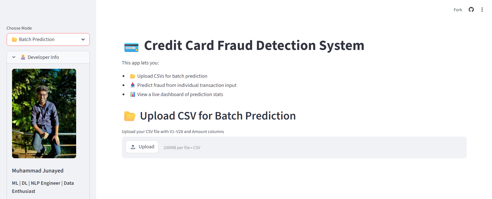

# 💳 Credit Card Fraud Detection



This project focuses on identifying fraudulent credit card transactions using real-world anonymized data. The dataset is highly imbalanced, with only ~0.172% of transactions marked as fraud.

---

## 🧑‍💻 Developer Quickstart

### ✅ Prerequisites
- Python 3.10+ (notebooks created with Python 3.11)
- Jupyter Notebook or JupyterLab

### ✅ Setup
```bash
python -m venv .venv
source .venv/bin/activate
pip install pandas numpy scikit-learn imbalanced-learn xgboost seaborn matplotlib jupyter
```

### ✅ Dataset
Download the **Credit Card Fraud Detection** dataset from Kaggle and place it locally.  
The notebooks currently read from:
```
/kaggle/input/creditcardfraud/creditcard.csv
```
Update the path to your local file, e.g. `data/creditcard.csv`.

### ✅ Run Notebooks
```bash
jupyter notebook
```
Open:
- `credit-card-fraud-detection.ipynb`
- `credit-card-fraud-detection-almost_complete.ipynb`

### ✅ Optional: Streamlit App
See the `streamlit-deply` branch for the app. After training/saving a model, run:
```bash
streamlit run app.py
```

---

## 📁 Repository Contents
- `credit-card-fraud-detection.ipynb` — EDA and baseline modeling
- `credit-card-fraud-detection-almost_complete.ipynb` — full pipeline with SMOTE/XGBoost
- `Muhammad Junayed_Final Report_BS23_Credit Card Fruad Detection.pdf` — project report
- `Credit_img.png` — project image

---

## 📊 Dataset Overview

- **Total Transactions**: 284,807
- **Fraudulent Transactions**: 492 (≈ 0.172%)
- **Normal Transactions**: 284,315
- **Duration Covered**: 2 days
- **Features**: 
  - `Time` and `Amount` (raw features)
  - `V1` to `V28`: anonymized features from PCA transformation
  - `Class`: Target variable (`0` = Not Fraud, `1` = Fraud)

---

## 🎯 Objective

Detect fraudulent transactions using machine learning techniques, despite the class imbalance. Evaluate models using suitable metrics like AUPRC, Recall, F1 Score, and visualize model performance.

---

## 🔍 Exploratory Data Analysis (EDA)

- **Duplicates**: 1081 rows were exact duplicates and dropped.
- **Fraud Timing**:
  - Peaks around hour 10–12, 26, and 42 out of 48 hours.
- **Fraud Amount**:
  - Fraudulent transactions are usually low-to-mid in amount.
- **Correlation Matrix**:
  - Features like `V4`, `V11`, `V2`, `V17`, `V14` showed strongest correlation (±0.1–0.3) with the fraud class.

---

## ⚙️ Preprocessing Steps

- Dropped duplicates
- Scaled `Time` and `Amount` using `StandardScaler`
- Created undersampled and SMOTE-balanced datasets
- Selected top features based on correlation and model importance

---

## 🔁Models Implemented

### ✅ Random Forest (Undersampling)

- Balanced classes by undersampling majority (non-fraud) class
- Achieved **AUPRC ~0.98**, **ROC-AUC ~0.98**, **F1 ~0.96**

### ✅ XGBoost with SMOTE

- Used pipeline: `SMOTE + XGBoost`
- Tuned hyperparameters using `RandomizedSearchCV`
- Achieved high F1, Precision, Recall and AUPRC

### ✅ LightGBM and Logistic Regression (for comparison)

- Logistic Regression was used with class weighting
- LightGBM used for speed and scalability

---

## 📏 Evaluation Metrics

Due to imbalance, we prioritized:

| Metric         | Why It Matters                        |
|----------------|----------------------------------------|
| **AUPRC**      | Best for imbalanced data               |
| **F1 Score**   | Balances precision & recall            |
| **Recall**     | Catch as many frauds as possible       |
| **Precision**  | Avoid false alarms                     |
| **ROC-AUC**    | Measures separability (used secondarily) |

---

## 📉 Visualizations

- **Precision-Recall Curve**
- **ROC Curve**
- **Confusion Matrix**
- **Correlation Heatmaps**
- **Transaction Time Distribution**

---

## 🚀 Deploy Locally (Streamlit Branch)
- Use `joblib` to load the trained model
- Run with `streamlit run app.py`
